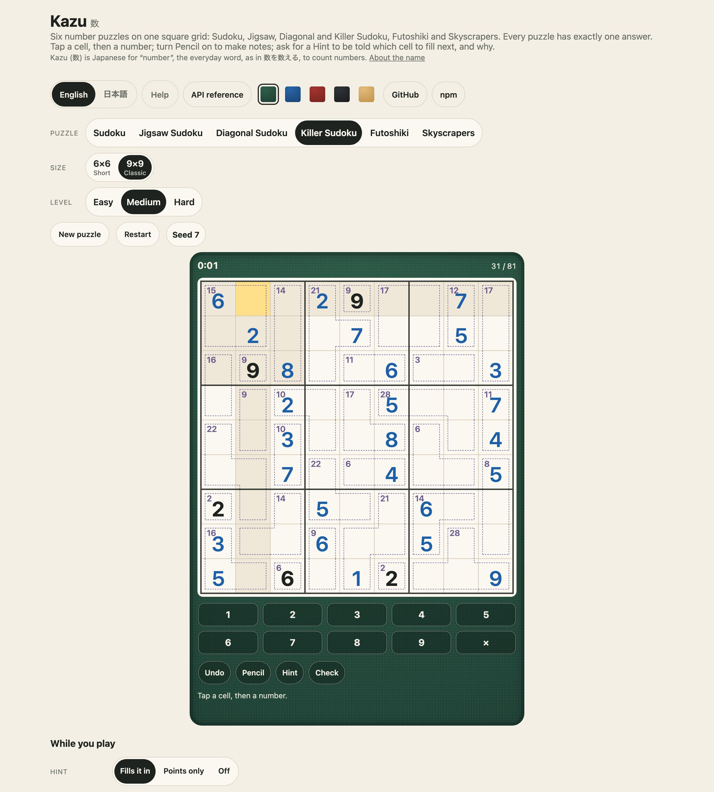
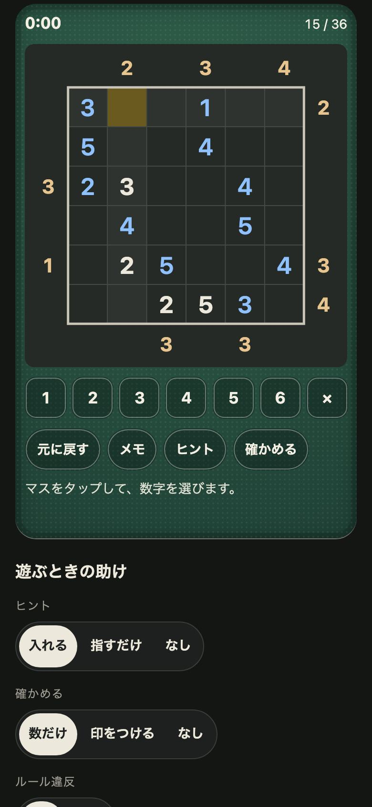

<h1 align="center">Kazu <sub>数</sub></h1>

<p align="center"><strong>Grid number and logic puzzles for JavaScript and TypeScript.</strong><br>
Sudoku (4×4 to a 25×25 Colossus), Jigsaw, Diagonal and Killer Sudoku, Futoshiki, Skyscrapers, Shikaku, Hitori, Nurikabe, Akari, Juosan, Slitherlink, Masyu, Yajilin, Ripple Effect, Kakuro, Fillomino and Heyawake. Dedicated typed engines, independently checked puzzles, SVG drawing, saved progress, and English and Japanese players for touch, mouse and keyboard. No runtime dependencies.</p>

<p align="center">
  <a href="https://github.com/johnmorrisdotca/kazu/actions/workflows/ci.yml"></a>
  <a href="https://www.npmjs.com/package/@johnmorrisdotca/kazu"></a>
  <a href="./LICENSE"></a>
  
</p>

<p align="center"><a href="https://johnmorrisdotca.github.io/kazu/"><strong>Play a puzzle →</strong></a> · <a href="https://johnmorrisdotca.github.io/kazu/api.html">API reference</a></p>

<p align="center">
  
  
</p>

Kazu is a family of grid puzzles: number placement, regions, shading, lights and loops. Each puzzle has its own rules and engine. The original number puzzles are
played at [itsutsu.com](https://itsutsu.com), which this package was taken out of, and in
[the demo](https://johnmorrisdotca.github.io/kazu/), with nothing to install.

## In 30 seconds

```sh
npm install @johnmorrisdotca/kazu
```

```ts
import { checkKazu, countKazuSolutions, generateKazu, hintKazu } from "@johnmorrisdotca/kazu";

const puzzle = generateKazu("sum-cages", 9, "medium", 42);   // a Killer Sudoku: the same one in every browser, for ever
countKazuSolutions("sum-cages", 9, puzzle.givens);            // 1: exactly one answer
checkKazu("sum-cages", 9, puzzle.givens, puzzle.solution);    // { ok: true }, read in O(cells)

const sudoku = generateKazu("number-place", 9, "easy", 7);
hintKazu("number-place", 9, sudoku.givens, new Array(81).fill(0));
// { cell: 2, value: 8, why: "only-number", replaces: false }: which cell, what goes in it, and why
```

And in a page, a puzzle to play, by touch, mouse and keyboard, with nothing else to set up:

```html
<script type="module" src="https://cdn.jsdelivr.net/npm/@johnmorrisdotca/kazu@1/dist/element-define.js"></script>
<kazu-board kind="number-place" size="9" level="medium" seed="7"></kazu-board>
```

## Who it is for

- **Puzzle sites and apps** that want these number puzzles with the rules already right: puzzles everybody
  plays alike from a seed, a check a server can trust in O(cells), a hint that is a reason and not just
  an answer, and runs kept as short strings.
- **Anyone making number puzzles of their own**, who wants a solver that counts answers, generators whose
  every puzzle has exactly one, and the layout of groups (rows, columns, boxes, regions, diagonals, cages)
  one solver reads for four of the six.
- **Pages that just want the grid**: it draws itself as SVG text, and plays itself in an element or one
  function call, with a number pad, pencil marks, Undo, Hint, Check and a clock, and its words in English and
  Japanese.

## Features

- **Seven puzzles, three levels.** Sudoku (4×4, 6×6, 9×9, a 16×16 Giant and a 25×25 Colossus), Jigsaw, Diagonal and Killer Sudoku, Futoshiki and Skyscrapers, each at `easy`, `medium` and `hard`, named by kebab-case keys.
- **Six number puzzles, three levels.** Sudoku (4×4, 6×6, 9×9, a 16×16 Giant and a 25×25 Colossus), Jigsaw, Diagonal and Killer Sudoku, Futoshiki and Skyscrapers, each at `easy`, `medium` and `hard`, named by kebab-case keys. Shikaku and Juosan use dedicated rectangle and territory models.
- **Four levels on the grid puzzles.** Shikaku, Akari, Slitherlink, Hitori, Fillomino and Kakuro each make `easy`, `medium`, `hard` and `extra-hard` boards, at three or more sizes each, every one with exactly one answer and rated by what a person must do to solve it: [Levels of the grid puzzles](#levels-of-the-grid-puzzles).
- **Exactly one answer.** A generator makes puzzles from a seed, and a solver that counts answers confirms there is one. The same kind, size, level and seed make the same puzzle in every browser and every Node, for ever.
- **A check a server can trust.** `checkKazu` reads a finished grid in O(cells), with no search, and says the first thing wrong in words.
- **A hint that is a reason.** Which cell to fill next, with the rule that says so (a cell with one number left, a number with one place left), never built on a wrong entry.
- **Puzzles and runs as short strings**, so a game half done, its pencil marks and its steps can be kept in a database column.
- **Drawn as SVG text**, in an entry of its own: a server that only checks answers never loads the drawing.
- **Played in any page** by touch, mouse and keyboard, with pencil marks, Undo, Hint, Check and a clock, as one function call (`mountKazu`) or one tag (`<kazu-board>`).
- **English and Japanese**, in the board's words, the puzzles' names and rules, and the demo.
- **No dependencies**, no network requests, no sound, no animation, and nothing stored outside the page it is in.

## Use it in your project

Kazu is three things, each usable without the others: **the puzzles** (making, solving, checking and hinting, as plain functions over strings), **the drawing** (SVG text), and **the page** (a mounted board or a tag). The table under [The element](#the-element) says which entry holds which. The examples are one puzzle each time, written in `number-place` at 9×9.

### 1. The API alone, on a server

```ts
import { checkKazu, generateKazu } from "@johnmorrisdotca/kazu";

const { givens } = generateKazu("number-place", 9, "medium", 42);   // send `givens` to the browser; keep `42` and the answer
checkKazu("number-place", 9, givens, answerFromThePlayer);          // { ok: true } or { ok: false, reason }, in O(cells)
```

Importing the main entry on a server is safe: it touches no page.

### 2. One tag, no bundler

```html
<script type="module" src="https://cdn.jsdelivr.net/npm/@johnmorrisdotca/kazu@1/dist/element-define.js"></script>
<kazu-board kind="number-place" size="9" level="medium" seed="42"></kazu-board>
<script>
  document.querySelector("kazu-board").addEventListener("kazu-solve", (event) => console.log(event.detail.elapsedMs));
</script>
```

### 3. A bundler, and a framework

`import "@johnmorrisdotca/kazu/element/define"` once, in code that runs in the browser, and `<kazu-board>` is a tag like any other. The tag draws itself in the page's own DOM, so the page's CSS reaches it. Its attributes are read again when they change, and it speaks through DOM events (`kazu-change`, `kazu-hint`, `kazu-check`, `kazu-solve`) that carry a `detail`.

```jsx
// React 19
import { useEffect, useRef } from "react";
import "@johnmorrisdotca/kazu/element/define";

export function Puzzle({ seed, onSolved }) {
  const board = useRef(null);
  useEffect(() => {
    const listen = (event) => onSolved(event.detail.elapsedMs);
    board.current?.addEventListener("kazu-solve", listen);
    return () => board.current?.removeEventListener("kazu-solve", listen);
  }, [onSolved]);
  return <kazu-board ref={board} kind="number-place" size="9" level="medium" seed={String(seed)} />;
}
```

```vue
<!-- Vue 3: tell the compiler the tag is not a Vue component -->
<script setup>
import "@johnmorrisdotca/kazu/element/define";
defineProps({ seed: Number });
</script>
<template>
  <kazu-board kind="number-place" size="9" level="medium" :seed="seed" @kazu-solve="(event) => console.log(event.detail.elapsedMs)" />
</template>
<!-- in vite.config: vue({ template: { compilerOptions: { isCustomElement: (tag) => tag.startsWith("kazu-") } } }) -->
```

```svelte
<!-- Svelte 5 -->
<script>
  import "@johnmorrisdotca/kazu/element/define";
  let { seed } = $props();
  let board;
  $effect(() => {
    const listen = (event) => console.log(event.detail.elapsedMs);
    board.addEventListener("kazu-solve", listen);
    return () => board.removeEventListener("kazu-solve", listen);
  });
</script>
<kazu-board bind:this={board} kind="number-place" size="9" level="medium" seed={seed}></kazu-board>
```

```ts
// Angular: a standalone component with CUSTOM_ELEMENTS_SCHEMA
import { Component, CUSTOM_ELEMENTS_SCHEMA } from "@angular/core";
import "@johnmorrisdotca/kazu/element/define";

@Component({
  selector: "app-puzzle",
  standalone: true,
  schemas: [CUSTOM_ELEMENTS_SCHEMA],
  template: `<kazu-board kind="number-place" size="9" level="medium" seed="42" (kazu-solve)="solved($event)"></kazu-board>`,
})
export class Puzzle {
  solved(event: Event) { console.log((event as CustomEvent).detail.elapsedMs); }
}
```

In Next.js or any server-rendering framework, import the define entry from a client component, so the tag is defined in the browser. Or skip the tag and call `mountKazu(element, options)` from `@johnmorrisdotca/kazu/play` in an effect: the handle it returns has `destroy()`.

These recipes are written to the tag's documented attributes and events; they are not built from the packed tarball by this repository's tests, which play the tag in a bare page in Chromium and WebKit.

### What a developer gets

- **Typed results**, with a doc comment on every export. Every function is pure and returns new values.
- **No dependencies.** ES modules, an entry per concern, and `sideEffects` set so that only the define entry has an effect.
- **Where it runs.** See [Browser support](#browser-support).

## The puzzles

A puzzle is a grid of `size × size` cells, a few printed numbers and whatever else the kind prints, and
exactly one answer. Every kind is named by a kebab-case key.

| Key | Called | In Japanese | Sizes | What it prints | What is new |
| --- | --- | --- | --- | --- | --- |
| `number-place` | Sudoku | ナンプレ | 4×4, 6×6, 9×9, 16×16, 25×25 | numbers | every row, column and box holds each number once; the 16×16 Giant uses 1 to 9 and then A to G, and the 25×25 Colossus goes on to P |
| `jigsaw` | Jigsaw Sudoku | 変形ナンプレ | 5×5, 6×6, 7×7, 9×9 | numbers, and the regions | the boxes are irregular regions, each joined and none a row or a column |
| `diagonal` | Diagonal Sudoku | 対角ナンプレ | 6×6, 9×9 | numbers | the two long diagonals hold each number once too |
| `sum-cages` | Killer Sudoku | サムナンプレ | 6×6, 9×9 | cages and their sums | next to no numbers: dashed cages each add to a sum, and repeat nothing |
| `more-or-less` | Futoshiki | 不等式 | 4×4, 5×5, 6×6, 7×7 | numbers, and more-than marks | rows and columns, and every mark between two cells must be true |
| `towers` | Skyscrapers | 摩天楼 | 4×4, 5×5, 6×6, 7×7 | numbers, and clues round the edge | a clue is how many towers show from there; a taller one hides those behind it |

Each is made at three levels, `easy`, `medium` and `hard`: what the solver needed, not how many numbers
are printed. Easy yields to singles alone (a cell with one number left, a number with one place left in a
group); medium needs one guess; hard whatever it takes. Sum Cages' levels are the size of its cages, and
fewer of them.

*Sudoku* 数独 is Nikoli's mark in Japan, so its Japanese name here is ナンプレ (Number Place, the puzzle's
own original name and the word Japanese publishers use); the English names are the ones players search
for. `KAZU_NAMES` has each puzzle's names, its rules in English and Japanese, and where it comes from.

## Making, solving and checking

```ts
import { checkKazu, generateKazu, solveKazu, countKazuSolutions, kazuGuessDepth, readGivens } from "@johnmorrisdotca/kazu";

const { kind, size, level, seed, givens, solution } = generateKazu("towers", 6, "hard", 1234);
solveKazu("towers", 6, givens) === solution;        // the one answer, worked out from the givens alone
countKazuSolutions("towers", 6, givens);              // 1 (up to a limit, two by default); null for givens that are not a puzzle
kazuGuessDepth("towers", 6, givens);                  // how many guesses a person needs: 0 easy, 1 medium, more hard
readGivens("towers", 6, givens);                      // { cells, clues, … }: what the puzzle was printed with
```

The same kind, size, level and seed make the same puzzle in every browser and every Node, for ever
(`seededRandom` is mulberry32). That is the promise itsutsu.com's kept runs and solves are built on, and
it is held by a test: `src/site.fixture.json` is 3,600 puzzles the site made before the move, every kind at
every size and level from sixty seeds, and each is made again here, givens and solution, byte for byte.
Changing how any puzzle is made is a new major version, never a fix.

`checkKazu(kind, size, givens, answer)` reads a finished grid in O(cells), with no search: right in every group,
every given where it was, every cage, mark and clue true. `{ ok: false, reason }` says the first thing
wrong (`"row 3 repeats a number"`, `"cage 4 does not add to 17"`, `"the top clue 3 sees 2"`), in the words the site
has always used. It restates the rules rather than reading the solver's mind, so a server can trust it.
A solver and a generator never run on a server unless you ask them to.

A run is kept as short strings the site's own stored runs decode as they are: `encodeRun(entries)` and
`decodeRun(code, size)` (one character a cell, `.` for empty, A to P past nine), `encodeSteps` and
`decodeSteps` for a step log, `kazuHash(givens)` for a fingerprint of a puzzle, and `encodeNotes` and
`decodeNotes` for Kazu's own pencil marks.

### A hint

```ts
import { hintKazu } from "@johnmorrisdotca/kazu";

hintKazu("number-place", 9, givens, entries);
// for example { cell: 25, value: 7, why: "only-place", group: { type: "row", index: 2 }, replaces: false }
```

It reasons from what is right on the grid so far (a wrong entry is treated as empty, so it never builds on a
mistake), one step at a time, as a person does: a cell only one number fits (`only-number`, and `by` says
whether a cage's sum, a Futoshiki mark or a Skyscrapers clue did part of the ruling out), or a number with
only one place left in a row, column, box, region or diagonal (`only-place`). When nothing follows by a single
step, which a hard puzzle asks for, it says so (`answer`). `mountKazu` puts the reason into words.

## Drawing a puzzle

```ts
import { drawKazu, KAZU_STYLE } from "@johnmorrisdotca/kazu/draw";

const svg = drawKazu("sum-cages", 9, givens, { entries, notes, selected: 40, peers: true, conflicts: [3, 4], language: "ja" });
```

`drawKazu` returns SVG text: put it in a page, a file or an image, with nothing to load. It draws the grid with
its printed numbers and whatever has been written, pencil marks in a small grid in the cell, the heavier rules
round boxes or a Jigsaw's regions, the shaded diagonals, a cage's dashed outline with its sum in the corner,
the more-than marks as chevrons between cells, and the clues of a Towers puzzle round the edge. Null for givens
that are not a puzzle.

| Option | What it does |
| --- | --- |
| `entries` | what the player has written, row-major, 0 for empty |
| `notes` | pencil marks, a bit mask a cell: bit `v` is the note `v` |
| `selected`, `peers` | the chosen cell, and with `peers` its row, column and group and every cell holding its number washed |
| `conflicts` | cells that break a rule, in red with their numbers (`conflictsOf` finds them from the rules alone) |
| `wrong`, `hint` | the cells Check flagged, and the cell a hint pointed at |
| `done` | a faint wash of green, and `data-solved="true"` |
| `interactive` | a transparent square over every cell with its `data-cell`, for a page to press on (`mountKazu` does) |
| `language`, `label` | what a screen reader hears, and a description instead of "Sudoku puzzle, 9 by 9" |
| `style`, `frame` | `style: true` puts `KAZU_STYLE` inside, so the drawing stands alone as an image; `frame` draws a wooden frame round the paper |

Generic colours, no branding: every colour is a custom property on `.kazu` (`--kz-paper`, `--kz-ink`,
`--kz-given`, `--kz-entry`, `--kz-note`, `--kz-grid`, `--kz-box`, `--kz-frame`, `--kz-cage`, `--kz-clue`,
`--kz-diagonal`, `--kz-peer`, `--kz-same`, `--kz-select`, `--kz-hint`, `--kz-conflict`, `--kz-wrong`,
`--kz-good`), so a page sets only what it wants different, and the paper follows the page's light or dark. The parts carry classes
and data attributes to style or find them: `kz-given`, `kz-entry`, `kz-note`, `kz-cage-sum`, `kz-clue`, `kz-mark`,
`kz-conflict`, `kz-hit` (`data-cell`). It is one steady square whatever is drawn, so nothing moves as numbers
are written, and nothing in it can be selected, dragged or double-tapped into a selection.
`kazuGeometry(kind, size)` says where every cell is in the drawing and which cell a point is over, so a page of
your own can play it.

## Playing it in a page

```ts
import { mountKazu } from "@johnmorrisdotca/kazu/play";

const board = mountKazu(document.getElementById("here")!, {
  kind: "towers", size: 6, givens, solution, level: "hard", seed: 1234,
  hints: "show", check: "count",
  onChange: ({ run, notes, elapsedMs }) => keep(run, notes, elapsedMs),   // to carry on a puzzle half done
  onSolve: ({ answer, elapsedMs, helped }) => send(answer, elapsedMs, helped),   // `answer` is what checkKazu takes
});
board?.undo(); board?.hint(); board?.load({ kind: "diagonal", size: 9, givens: other });
```

Tap a cell and tap a number on the pad (or type it); tap the chosen cell again to step its number on, 1, 2, 3
… and round to empty. Turn **Pencil** on and the pad writes small notes instead, and a number written takes itself
out of the notes of the cells it shares a group with. **Undo** takes the last change back, **Hint** says which
cell to fill next and why, **Check** says how many cells are wrong, never which. A clock starts on the first entry
and stops when the last cell is right, and waits while the page is hidden.

The keys: the arrows move, a number (1 to 9, then A to G on the 16×16 and on to P on the 25×25) fills the chosen cell, Shift with a
number writes it as a pencil mark, Backspace empties the cell, N turns Pencil on or off (the slash key on the 25×25, where N is the number 23), Ctrl or Cmd with Z
undoes, Escape lets the cell go. The board's box keeps one steady square, and the lines of words under it keep
the room their longest wording takes, so nothing moves as numbers are written or messages come and go. Nothing
the player touches can be selected. Its words are English and Japanese and follow the page's `lang`.

| Option | What it does |
| --- | --- |
| `kind`, `size`, `givens`, `solution` | the puzzle; `solution` is worked out when Hint or Check needs it if you leave it out |
| `level`, `seed` | carried in the events, to say which puzzle it was |
| `run`, `notes`, `elapsed` | a run kept half done (`decodeRun`'s code), its pencil marks, and the milliseconds already on the clock |
| `hints` | `place` (default) writes the number it found, `show` only points at the cell and says why, `off` takes the button away |
| `check` | `count` (default) says how many are wrong, `show` marks them too, `off` takes the button away |
| `conflicts`, `peers`, `tidy`, `tapToStep` | each on by default: cells that break a rule in red, the chosen cell's lines washed, a written number rubbed out of the notes beside it, a tap on the chosen cell stepping it on |
| `clock`, `controls` | the clock (default on); the number pad and buttons (default on) |
| `language` | `en` or `ja`; left out, the host's `lang` or the page's, and it follows the page's |
| `onChange`, `onHint`, `onCheck`, `onSolve` | callbacks, and the same four as DOM events on the host: `kazu-change`, `kazu-hint`, `kazu-check`, `kazu-solve`. Each `detail` has `run`, `notes`, `answer`, `progress`, `elapsedMs`, `hints`, `checks`, `helped` and `solved` |

Everything a button does is also a method on the handle (`undo`, `hint`, `check`, `restart`, `pencil`, `select`,
`enter`, `load`, `set`, `destroy`). The rules it plays by are `game.ts`'s, which are pure and need no page
(`newKazuGame`, `enterNumber`, `toggleNote`, `undoKazu`, `isSolved`), so a server can replay a game.

### The element

```html
<script type="module" src="https://cdn.jsdelivr.net/npm/@johnmorrisdotca/kazu@1/dist/element-define.js"></script>
<kazu-board kind="sum-cages" size="9" level="medium" seed="42"></kazu-board>
<kazu-board kind="towers" size="5" givens="…" solution="…" hints="show" lang="ja"></kazu-board>
```

Or `import "@johnmorrisdotca/kazu/element/define"` in a bundle. Attributes, each read again when it changes:
`kind` (the key of one of the six), `size`, `level` (`easy`, `medium` or `hard`) and `seed` (a new one if left out): the
puzzle is made in the page; or `size` with `givens` and `solution`, a puzzle of your own; `run`, `notes` and
`elapsed`, to carry on a puzzle half done; `hints` (`place`, `show`, `off`); `check` (`count`, `show`, `off`);
`conflicts`, `peers`, `tidy`, `tap-to-step`, `clock` and `controls`, each on unless set to `off`; and `lang`. It
fires the four events above and has the methods `undo()`, `hint()`, `check()`, `restart()`, `pencil()` and
`select()`. Importing either entry on a server is safe.

| Import | What it holds |
| --- | --- |
| `@johnmorrisdotca/kazu` | the generator, the solver, the check, the hint, the codes, and the game in play as pure functions: everything but the drawing and the page |
| `@johnmorrisdotca/kazu/draw` | `drawKazu` and the rest of the drawing as SVG text, its style, where everything sits in it, the words and the names; no page needed |
| `@johnmorrisdotca/kazu/play` | `mountKazu`: a puzzle played in any element by touch, mouse and keyboard, with its pad, buttons, clock, words and events |
| `@johnmorrisdotca/kazu/element` | the `KazuBoard` class behind `<kazu-board>`, to extend or to define under another name |
| `@johnmorrisdotca/kazu/element/define` | defines `<kazu-board>` on the page, for its effect |

## API

The [API reference](https://johnmorrisdotca.github.io/kazu/api.html) lists every export of every entry point with its signature and its doc comment. It is made from the source by `pnpm site`, so it cannot fall behind the code.

| Export | What it does |
| --- | --- |
| `generateKazu(kind, size, level, seed)` | a puzzle: `{ kind, size, level, seed, givens, solution }`; throws a RangeError for what it does not make |
| `generateNumberPlace`, `generateJigsaw`, `generateDiagonal`, `generateSumCages`, `generateMoreOrLess`, `generateTowers` | each puzzle's own generator |
| `solveKazu`, `countKazuSolutions`, `kazuGuessDepth` | the one answer, how many answers (up to a limit and a budget; null when it cannot say), and how many guesses a person needs |
| `checkKazu(kind, size, givens, answer)`, `isKazuGivens` | whether a finished grid is right, in O(cells), and whether givens are a well-formed puzzle |
| `hintKazu(kind, size, givens, entries)` | the next cell a person could fill in, and why |
| `conflictsOf(givens, values)` | the cells that break a rule right now, from the rules alone |
| `readGivens(kind, size, code)` | what a puzzle was printed with: cells, regions, cages, marks or clues; null for a code that is not a puzzle |
| `encodeCells`, `decodeCells`, `symbolOf`, `valueOfSymbol`, `stepEntry`, `kazuHash` | a grid as a string, one character a cell |
| `encodeJigsaw`, `encodeKiller`, `encodeMoreOrLess`, `encodeTowers` and their `decode…` | each kind's givens code |
| `encodeRun`, `decodeRun`, `encodeNotes`, `decodeNotes`, `encodeSteps`, `decodeSteps` | a puzzle half done, its pencil marks and its steps |
| `newKazuGame`, `enterNumber`, `toggleNote`, `clearCell`, `undoKazu`, `restartKazu`, `isSolved`, `kazuProgress`, `answerOf`, `valuesOf`, `numberCounts`, `gameConflicts` | a game in play as pure functions; each returns a new game |
| `boxedLayout`, `regionsAreSound`, `cageOutline`, `lineFrom`, `towersSeen`, `cluesOf` | the groups a puzzle is made of, a cage's outline, and what a clue sees |
| `seededRandom(seed)`, `freshKazuSeed`, `isKazuSeed` | the mulberry32 stream every puzzle is made from, and seeds |
| `KAZU_KINDS`, `KAZU_LEVELS`, `KAZU_SPECS`, `KAZU_KIND_OF_SITE_KIND` | the six keys, the three levels, what each offers, and the names itsutsu.com's code used |
| `KAZU_NAMES`, `KAZU_SIZE_NAMES`, `KAZU_STRINGS`, `kazuSay` | names, rules and words in English and Japanese |

Every function is pure: it returns new values and never changes what it was given.

## Theming

Nothing here is branded. The drawing and the playable board are coloured by custom properties, and a page sets only the ones it wants different. The paper follows the device's light or dark setting; `data-theme="light"` or `"dark"` on `<html>` forces one.

**The drawing** (`drawKazu`), custom properties on `.kazu`:

| Property | What it colours | Light | Dark |
| --- | --- | --- | --- |
| `--kz-paper` | the grid's paper | `#fbf8f1` | `#262a27` |
| `--kz-ink` | a mark's outline (Futoshiki's chevrons) | `#1f2320` | `#ece8dc` |
| `--kz-given` | a printed number | `#1f2320` | `#ece8dc` |
| `--kz-entry` | a number the player wrote | `#1d5fa8` | `#8fc1ff` |
| `--kz-note` | a pencil mark | `#5b6b7d` | `#9fb0c2` |
| `--kz-grid` | the thin lines between cells | `#cfc6b2` | `#454a44` |
| `--kz-box` | the heavy lines round boxes and regions | `#3a3d38` | `#c9c5b8` |
| `--kz-frame` | the frame, when `frame` is on | `#a98954` | `#6b5632` |
| `--kz-cage` | a Killer Sudoku cage and its sum | `#6a5a8e` | `#b8a5e6` |
| `--kz-clue` | a Skyscrapers clue | `#7a4b14` | `#e8c48f` |
| `--kz-diagonal` | the two diagonals of Diagonal Sudoku | `#e9dfc6` | `#34382f` |
| `--kz-peer` | the chosen cell's row, column and group | `#efe8d8` | `#2f332f` |
| `--kz-same` | every cell holding the chosen number | `#dcd0f2` | `#433a5c` |
| `--kz-select` | the chosen cell | `#ffe08a` | `#6b5a1f` |
| `--kz-hint` | the cell a hint pointed at | `#b9e3c4` | `#25503a` |
| `--kz-conflict` | a cell that breaks a rule | `#f4b8ad` | `#6e2f26` |
| `--kz-wrong` | a cell Check flagged | `#f4b8ad` | `#6e2f26` |
| `--kz-bad` | the number in a cell that breaks a rule | `#b5452c` | `#ff8a6b` |
| `--kz-good` | a solved puzzle's wash | `#2f7a4f` | `#6fcf97` |
| `--kz-font` | the numbers' type | the system's own | the same |

**The playable board** (`mountKazu` and `<kazu-board>`) wears the drawing's properties, and six of its own on `.kazu-play`:

| Property | What it colours | Light | Dark |
| --- | --- | --- | --- |
| `--kzp-ink` | text, the number pad's numbers, and a pressed button | `#1f2320` | `#ece8dc` |
| `--kzp-muted` | the progress count, the erase key and the words under the board | `#6b6f68` | `#a09d93` |
| `--kzp-rule` | borders | `#ddd6c6` | `#3a3d38` |
| `--kzp-surface` | the number pad and the buttons | `#fbf8f1` | `#1d201e` |
| `--kzp-accent` | the focus ring, and a warning in the words under the board | `#b5452c` | `#ff8a6b` |
| `--kzp-good` | the words and the clock once the puzzle is solved | `#2f7a4f` | `#6fcf97` |

```css
kazu-board, .kazu, .kazu-play { --kz-select: #ffd23f; --kz-entry: #0b5cad; --kzp-accent: #8a1c1c; }
```

The demo's own page is the worked example: its green felt and its cloth patches are the family's stylesheet, [`demo/family.css`](./demo/family.css), which is the same file byte for byte in every sibling's demo, and a test holds it to its hash. The parts of the drawing carry classes (`kz-given`, `kz-entry`, `kz-note`, `kz-cage-sum`, `kz-clue`, `kz-mark`, `kz-conflict`, `kz-hit`) for anything a property cannot reach.

## Limits

All of these are held by tests, and the ones with a name are exported.

| Limit | Value | Where |
| --- | --- | --- |
| Puzzles | the six keys of `KAZU_KINDS` | the table under [The puzzles](#the-puzzles) |
| Levels | `easy`, `medium`, `hard` | `KAZU_LEVELS` |
| Sizes | each puzzle's own, 4×4 to 25×25 | `KAZU_SPECS[kind].sizes` |
| A seed | a whole number from 1 to 2,147,483,647 | `KAZU_SEED_MOST`, `isKazuSeed` |
| Symbols in a grid | `1` to `9`, then `A` to `G` for the 16×16 and on to `P` for the 25×25 | `symbolOf`, `valueOfSymbol` |
| The longest givens code | Sudoku 625 characters, Jigsaw 162, Diagonal 81, Killer Sudoku 286, Futoshiki 133, Skyscrapers 77 | `KAZU_SPECS[kind].mostCells`, for a route that must refuse anything larger |
| Answers counted | two, so that "many" costs no more than "two" | the `limit` argument of `countKazuSolutions` |
| The solver's work | 2,000,000 steps, then it says it cannot say (`null`) | the `budget` argument of `solveKazu` |
| A step log | the newest 400 steps | `KAZU_STEPS_KEPT` |

A generator never runs on a server unless you ask it to. The check never searches: it is linear in the size of the grid.

## Browser support

Any browser with ES2020 modules, custom elements and CSS `aspect-ratio`: Chrome and Edge 88, Safari 15, Firefox 89, all from 2021 on. The element draws in the page's own DOM, with no shadow DOM and no CSS the page cannot reach. The demo is played in a real Chromium at a phone's width (with touch) and a desk's, and in WebKit, Safari's engine, at a phone's width; Firefox is not in that run. The package itself (everything but the drawing and the page) needs no DOM: it runs in Node 22 or later (CI tests 22 and 24). Deno and Bun are not tested.

## Languages

English and Japanese, chosen by the `language` option, the host's `lang` or the page's, and followed when the page's `lang` changes. The demo has a chooser of its own and takes the browser's language on a first visit. The board's words (`KAZU_STRINGS`), each puzzle's names and rules (`KAZU_NAMES`) and the sizes' names are in both. **Japanese: included; not yet reviewed by a native reader. Corrections welcome.** Every string of the board is listed beside its English in [docs/strings-ja.md](./docs/strings-ja.md), and there is an [issue template](https://github.com/johnmorrisdotca/kazu/issues/new?template=fix-a-translation.md) for fixing one. Any other language is a table of your own, passed beside these two.

## Roadmap

Not here yet, and each welcome as an [issue](https://github.com/johnmorrisdotca/kazu/issues):

- A daily puzzle: a puzzle of the day for each kind and level, from the date, the way [Tane](https://github.com/johnmorrisdotca/tane) makes daily seeds.
- A command line: make a puzzle, solve a code, check an answer, and print the grid as text.

Left out on purpose: a puzzle with more than one answer, and any account, ranking or storage. A page keeps its own runs: `onChange` hands them over.

## Masyu — pearls and a single loop

Masyu is a line puzzle with its own cell-centre loop model. A white pearl lies on a straight section and the loop turns in at least one of its adjacent cells. A black pearl lies at a turn, with a straight section in each adjacent cell. One closed loop must pass through every pearl.

```ts
import { generateMasyu, checkMasyu, solveMasyu } from "@johnmorrisdotca/kazu/masyu";
import { mountMasyu } from "@johnmorrisdotca/kazu/masyu/play";

const puzzle = generateMasyu(5, 42);
checkMasyu(puzzle, puzzle.solution); // { ok: true }
solveMasyu(puzzle);                  // count: 1, complete: true
mountMasyu(document.querySelector("#board"), { board: puzzle });
```

The dedicated `/masyu`, `/masyu/play`, and `/masyu/draw` entry points keep the loop engine separate from number-entry state. Import them from `@johnmorrisdotca/kazu/masyu`, `@johnmorrisdotca/kazu/masyu/play`, and `@johnmorrisdotca/kazu/masyu/draw`. The solver uses bounded cell-degree search; it reports `complete: false` when its node budget stops. The seeded generator currently supports original 5×5 layouts only: four distinct loop families, with board symmetries, produce varied pearl patterns and loop lengths. It returns a puzzle only after a completed uniqueness proof. Larger boards are not advertised until they can be proved within the search budget. Hints expose a next loop edge from a proved unique solution; saved play data contains the public pearls, drawn edges, and whether a hint was used.

[Nikoli describes the Masyu rules here](https://www.nikoli.co.jp/en/puzzles/masyu/). The generated layouts are original and do not use Nikoli's grids or artwork.

## Yajilin — arrows, shaded cells and a loop

Yajilin places black cells by arrow counts and draws one loop through every remaining empty cell. Black cells do not touch by an edge; arrow cells are not shaded and are not part of the loop. The loop uses cell centres, not Slitherlink's grid edges.

```ts
import { generateYajilin, checkYajilin, solveYajilin } from "@johnmorrisdotca/kazu/yajilin";
import { mountYajilin } from "@johnmorrisdotca/kazu/yajilin/play";

const puzzle = generateYajilin(5, 42);
checkYajilin(puzzle, puzzle.solution.shaded, puzzle.solution.edges); // { ok: true }
solveYajilin(puzzle); // count: 1, complete: true
mountYajilin(document.querySelector("#board"), { board: puzzle });
```

Import the engine, player, and drawing from `@johnmorrisdotca/kazu/yajilin`, `@johnmorrisdotca/kazu/yajilin/play`, and `@johnmorrisdotca/kazu/yajilin/draw`. The solver enumerates public shade assignments, then checks the remaining cell-centre loop, with a finite node budget and an explicit incomplete result. The original seeded generator currently supports 5×5 only and keeps boards whose unique answer was proved. It varies both 3×3 and 3×4 loop families and their symmetries. Hints infer either a shade or a loop edge from the public clues and mark progress as helped. Save data contains only clues, current shades and drawn edges.

[Nikoli's Yajilin rules](https://www.nikoli.co.jp/en/puzzles/yajilin/) define the arrow counts, non-touching shaded cells and single loop. These original layouts use no Nikoli puzzle grids or artwork.

## Shikaku — rectangles in Kazu

The demo includes square boards (5, 7, 10 and 14 on a side), wide (10 × 6), tall (6 × 10) and custom rectangular boards, with width and height from 2 to 16, at four levels. The named Courtyard (square), Long Table (wide) and Narrow Garden (tall) packs each hold three uniquely proved challenges with useful titles. Shares and saved settings preserve both dimensions. It uses Kazu’s shared materials and pieces palette.

Shikaku belongs to the number-and-grid family. Its moves are rectangles rather than number entries, so it has a dedicated model and optional entry points; the existing six `KazuKind` values and saved Sudoku codes remain compatible.

```js
import { generateShikaku, newShikaku, placeShikaku, checkShikaku } from "@johnmorrisdotca/kazu/shikaku";
import { mountShikaku } from "@johnmorrisdotca/kazu/shikaku/play";
import { generateShikakuChallenge } from "@johnmorrisdotca/kazu/shikaku";

const { puzzle } = generateShikakuChallenge("wide", 2); // Causeway, a proved 10 × 6 puzzle
const player = mountShikaku(document.querySelector("#board"), {
  board: puzzle, material: "ivory", pieces: "ink", language: "en",
  onFinish: game => console.log(game.helped ? "Solved with help" : "Solved"),
});
// player.progress() saves public clues and rectangles; player.destroy() removes the player.
```

`generateShikakuChallenge("square" | "wide" | "tall", 1..3)` selects a named challenge and checks uniqueness with the existing solver.

Use `@johnmorrisdotca/kazu/shikaku`, `@johnmorrisdotca/kazu/shikaku/play`, or `@johnmorrisdotca/kazu/shikaku/draw`.

The root entry re-exports the engine, `/play` re-exports `mountShikaku`, and `/draw` re-exports `drawShikaku`. The dedicated entries let a consumer load only Shikaku. There are no runtime dependencies.

## Juosan — horizontal and vertical marks

Juosan gives each cell either a horizontal mark (`1`) or a vertical mark (`2`). A territory clue is the absolute difference between its horizontal and vertical mark counts; an unnumbered territory uses `difference: null`. Horizontal marks may make longer runs horizontally but never three vertically; vertical marks may make longer runs vertically but never three horizontally. See [Nikoli's English rules](https://www.nikoli.co.jp/en/puzzles/juosan/) for the original rule wording.

```ts
import { checkJuosan, generateJuosan, solveJuosan } from "@johnmorrisdotca/kazu/juosan";
import { mountJuosan } from "@johnmorrisdotca/kazu/juosan/play";

const puzzle = generateJuosan(3, 2, "easy", 42); // 3 × 2 training board; answer proved unique
solveJuosan(puzzle, 2);                         // { count: 1, complete: true, ... }
checkJuosan(puzzle, puzzle.solution);           // { ok: true, errors: [] }
const game = mountJuosan(document.querySelector("#board")!, { board: puzzle });
```

Juosan has a dedicated immutable engine and package paths: `@johnmorrisdotca/kazu/juosan`, `@johnmorrisdotca/kazu/juosan/play`, and `@johnmorrisdotca/kazu/juosan/draw`. The player accepts any valid supplied board from 2×2 through 16×16. The built-in seeded generator currently supports the two small training shapes, 3×2 and 2×3. Even seeds split the board into straight three-cell territories; odd seeds use one whole-board territory. In each case, the maximum difference clue plus the directional run rule proves the single uniform orientation. Its `level` setting is reserved and does not change rule difficulty yet. The demo saves progress locally, marks hint use as assisted, and offers keyboard and touch input in English and Japanese.

- `ShikakuBoard`: `width`, `height`, and row-major `clues` (zero for an empty cell). Dimensions are 2–16; clue areas sum to the grid area.
- `ShikakuRectangle`: zero-based `x`, `y`, `width`, `height`.
- `generateShikaku(width, height, level, seed)`: deterministic puzzle and solution; `level` is `easy`, `medium`, `hard` or `extra-hard` (`SHIKAKU_LEVELS`), and `SHIKAKU_SIZES` lists the square sides the demo offers (5, 7, 10, 14). The board is cut into interlocking rectangles by packing, not by straight cuts, each carries one number, and the answer is counted independently; every level is checked by solving the board (see [Levels](#levels-of-the-grid-puzzles)). It never returns an unproved board. If no board of a level is found within its attempts the next level down is made instead, which the rating shows.
- `rateShikaku(board)`: how hard a board is, measured by solving it: `depth` (0 rules alone, 1 supposing one rectangle, 2 more), `rules` (how many of the three rules a depth-0 solve needed), `probes`, and the number, area and ambiguity of the rectangles.
- `solveShikaku(board, placements?, {limit?, nodes?})`: exact-cover count, first answer, nodes visited and `complete`. The default limit is two answers and 100,000 nodes. Only `complete && count === 1` proves uniqueness; a stopped search is explicitly incomplete.
- `checkShikaku(board, rectangles)`: coverage and rectangle rule errors, independent of a stored answer. It accepts any valid completion.
- `newShikaku`, `placeShikaku`, `removeShikaku`, `undoShikaku`: immutable game operations. A placement replaces intersecting rectangles, and rule errors are allowed until checked. The game strips generated solutions.
- `hintShikaku(game)`: a rectangle from the single proved remaining partition, or `null`. Hints in the mounted player mark the run as helped.
- `encodeShikaku`, `decodeShikaku`: versioned JSON with only public puzzle data and placements, validated on restore. Undo history and the clock are session-only.
- `drawShikaku(board, options)`: SVG. Materials `ivory`, `wood`, `slate`; numbers `ink`, `tiles`; language `en`, `ja`.
- `mountShikaku(host, options)`: tap two opposite corner cells, or use arrows and Enter/Space. Delete removes a selected rectangle; Escape cancels a pending corner. Undo, Check, Hint, Restart and a modal board view are built in. The handle has `game`, `progress`, `set`, `restart`, `destroy`; callbacks and bubbling `shikaku-change` / `shikaku-finish` events carry copies of public state. Mount once per puzzle; use `set` for appearance changes.

The demo is `site/shikaku.html` after `pnpm site`; its generator runs in a module worker at `dist/shikakuWorker.js`. Deploy the worker with the built files and permit same-origin module workers. The npm player accepts a board synchronously; hosts can use their own worker when generating large custom boards. The demo stores progress locally and shares settings through the address. Shared seeds start fresh; they do not share your placements. Restart and page reload reset the session clock.

[Shikaku's rules are described by Nikoli](https://www.nikoli.co.jp/en/puzzles/shikaku/). This implementation generates its own puzzles and does not copy Nikoli's puzzle grids, wording or artwork.

## Akari — light the grid

Akari (美術館) places bulbs in white squares. Each bulb lights in straight lines until a black square or the edge. Every white square must be lit, bulbs cannot see each other, and a numbered black square must touch exactly that many bulbs. Boards may be square, wide, tall or custom, with each side from 2 to 16. The seeded generator scatters black squares at random (half the time in rotating pairs), lights them with random bulbs, numbers every black square that touches a white one, and then takes numbers away for as long as the board can still be solved the way the level asks, so the layouts are not a fixed motif. It returns a board only when its answer is proved single.

```js
import { generateAkari, checkAkari } from "@johnmorrisdotca/kazu/akari";
import { mountAkari } from "@johnmorrisdotca/kazu/akari/play";

const puzzle = generateAkari(7, 7, 42, "hard"); // width, height, seed, level ("medium" if left out)
const player = mountAkari(document.querySelector("#board"), {
  board: puzzle, material: "ivory", pieces: "ink", language: "en",
});
// player.progress() saves public clues and bulbs; player.destroy() removes the player.
```

Use `@johnmorrisdotca/kazu/akari`, `@johnmorrisdotca/kazu/akari/play`, or `@johnmorrisdotca/kazu/akari/draw`. The root package also re-exports the engine; the dedicated drawing and player entries keep those features optional. There are no runtime dependencies.

- `AkariBoard`: width, height and row-major `cells`: `null` is white, `false` is an unnumbered black square, and `0`–`4` are numbered black squares.
- `generateAkari(width, height, seed, level?)`: deterministic puzzle and its solution at `easy`, `medium`, `hard` or `extra-hard` (`AKARI_LEVELS`; `AKARI_SIZES` lists the square sides on offer: 5, 7, 10, 14). Easy keeps most of its numbers, medium is solved by the rules alone with as few as it can, hard needs supposing a bulb or an empty square, extra-hard needs the most of that. It returns only when an independent count proves exactly one answer; if no board of the level is found within its attempts the next level down is made, and the first generator, which cannot fail, is the last resort.
- `rateAkari(board)`: how hard a board is, measured by solving it: `depth` (0 rules alone, 1 supposing one square, 2 more), `probes`, and the numbers, bulbs and white squares.
- `solveAkari(board, {limit?, nodes?})`: counts placements, returns the first answer, visited nodes and `complete`; only `complete && count === 1` proves uniqueness. The default answer limit is two and the node budget is 250,000.
- `checkAkari(board, bulbs)`: checks a complete placement from the rules, independently of the generated answer. `progressAkari` reports dark squares and immediate conflicts while permitting unfinished numbered clues.
- `newAkari`, `toggleAkari`, `undoAkari`, `akariFinished`, `hintAkari`: immutable play operations. Hints require a proved unique answer and mark the game as helped.
- `encodeAkari`, `decodeAkari`: versioned JSON containing only public board data and player bulbs.
- `drawAkari(board, options)`: SVG with `ivory`, `wood` and `slate` materials, `ink` or `tiles` bulb pieces, and `en` or `ja` labels.
- `mountAkari(host, options)`: toggle bulbs by tap, click, Enter or Space. Arrow keys move through the grid; Delete removes a bulb. Undo, Check, Hint, Restart and a modal board view are built in. The handle has `game`, `progress`, `set`, `restart` and `destroy`.

The demo is `site/akari.html` after `pnpm site`. It shares Kazu's family header, footer, palette and felt board. Progress stays in local storage; share links carry board settings, not player data.

[Nikoli's Akari rules](https://www.nikoli.co.jp/en/puzzles/akari/) describe the same line-of-sight and numbered-square constraints. These boards are generated here; the implementation does not copy Nikoli's grids or artwork.

## Slitherlink

```js
import { generateSlitherlink } from "@johnmorrisdotca/kazu/slitherlink";
import { mountSlitherlink } from "@johnmorrisdotca/kazu/slitherlink/play";

const puzzle = generateSlitherlink(7, 7, 42, "hard"); // width, height, seed, level ("medium" if left out)
const player = mountSlitherlink(document.querySelector("#board"), {
  board: puzzle, material: "ivory", language: "en",
});
// player.progress() saves the public clues and selected edges.
```

The Slitherlink engine has its own edge model, checker, progress checker, bounded solution counter, seeded generator and immutable play state. `solveSlitherlink` distinguishes an exhausted search from a proved count; the generator returns only boards proved to have one loop. `generateSlitherlink(width, height, seed, level?)` makes `easy`, `medium`, `hard` or `extra-hard` (`SLITHERLINK_LEVELS`) boards, and `SLITHERLINK_SIZES` lists the square sides on offer (5, 7, 10). `rateSlitherlink(board)` measures a board by solving it: `depth` (0 rules alone, 1 supposing one edge, 2 more), `probes`, the numbers, how many of them say 0, and the loop's length. Boards may be 2–10 cells wide and high. The generator grows a random winding loop (a connected region without holes whose outline never touches itself), numbers every square with how many of its edges the loop uses, and takes numbers away, squares numbered 0 first, for as long as the board can still be solved the way the level asks, so boards are not a few shapes and few squares say 0. The player supports touch and mouse edge toggles, arrow-key focus, Enter/Space, undo, restart, checking, proved hints, save/restore, and ivory, wood and slate materials in English and Japanese.

Use `@johnmorrisdotca/kazu/slitherlink`, `@johnmorrisdotca/kazu/slitherlink/play`, or `@johnmorrisdotca/kazu/slitherlink/draw`. The demo is `site/slitherlink.html` after `pnpm site`. The rules are described by [Nikoli](https://www.nikoli.co.jp/en/puzzles/slitherlink/). This implementation uses original generated layouts and does not copy Nikoli puzzle grids, wording or artwork.

## Ripple Effect

```ts
import { generateRipple, newRipple, hintRipple } from "@johnmorrisdotca/kazu/ripple";
import { mountRipple } from "@johnmorrisdotca/kazu/ripple/play";

const puzzle = generateRipple(9, 9, 42);
const game = newRipple(puzzle);
const hint = hintRipple(game); // only returned after a unique completion is proved
const player = mountRipple(document.querySelector<HTMLElement>("#board")!, {
  board: puzzle, material: "ivory", pieces: "ink", language: "en",
});
```

Each room contains every number from 1 through its size exactly once. Repeated N values in one row or column have at least N cells between them, so their coordinate distance must exceed N. The DOM-free engine has independent completion and progress checks and a bounded solution counter that reports when a search stopped before proof. The original seeded 9×9 generator uses 3×3 rooms, seeded row-band, column-stack and digit permutations, and uniqueness-preserving clue removal. It returns only puzzles proved to have one completion; custom sizes are not advertised until their generator family passes the same proof checks. These are original layouts and do not reproduce Nikoli puzzle grids or artwork.

Use `@johnmorrisdotca/kazu/ripple`, `@johnmorrisdotca/kazu/ripple/play`, or `@johnmorrisdotca/kazu/ripple/draw`. The touch and keyboard player includes number entry, pencil notes, undo, restart, checking, unique-proof hints, accessible room boundaries, save/restore, and ivory, wood and slate materials with ink or tile pieces in English and Japanese. The demo is `site/ripple.html` after `pnpm site`. Rules: [Nikoli’s Ripple Effect page](https://www.nikoli.co.jp/en/puzzles/ripple_effect/).

## Kakuro — crossword sums in Kazu

Kakuro fills white cells with digits 1–9. Each across and down run must match its clue sum without repeating a digit. Run lengths are at least two, and every white cell belongs to exactly one run in each direction. [Nikoli describes the rules](https://www.nikoli.co.jp/en/puzzles/kakuro/); generated layouts here are original.

```js
import { generateKakuro, solveKakuro, checkKakuro } from "@johnmorrisdotca/kazu/kakuro";
import { mountKakuro } from "@johnmorrisdotca/kazu/kakuro/play";

const puzzle = generateKakuro(42, "hard", 8); // seed, level ("medium"), size including the totals' row and column (10)
const proof = solveKakuro(puzzle); // uniqueness only when complete && count === 1
const player = mountKakuro(document.querySelector("#board"), { board: puzzle, language: "en" });
player.progress(); // public clues, entries and pencil marks; no answer
```

`@johnmorrisdotca/kazu/kakuro/draw` provides standalone SVG drawing. `generateKakuro(seed, level?, size?)` makes a board of any side from 5 to 12 (`KAKURO_SIZES` lists those on offer: 6, 8, 10, 12) at `easy`, `medium`, `hard` or `extra-hard` (`KAKURO_LEVELS`). It lays out the black squares row by row so that no run is a single square or longer than the level allows, fills random digits, and changes digits or darkens squares until the answer is single; easy and medium also ease the board until the rules they promise are enough, and hard and extra-hard ask for supposing. A board is accepted only after a bounded exact count proves one answer, and a seed never throws: if a level is not found within its attempts the next level down is made, and the first generator is the last resort on a 10×10. `rateKakuro(board)` measures a board by solving it: `depth`, `plain` (the single-run rules were enough), `probes`, the runs, the longest run and the share of totals that can be made one way only. `solveKakuro` reports `complete: false` when its node budget or answer limit stops counting. `checkKakuro` validates completed runs independently; `progressKakuro` permits blanks while marking impossible totals and repeats. The bilingual player supports touch, arrows, digits, pencil mode, Undo, Hint, Check, Restart and versioned saved progress.

The Kakuro entries are `@johnmorrisdotca/kazu/kakuro`, `@johnmorrisdotca/kazu/kakuro/play` and `@johnmorrisdotca/kazu/kakuro/draw`.

## Fillomino — connected regions with exact areas

The dedicated package entries are `@johnmorrisdotca/kazu/fillomino`, `@johnmorrisdotca/kazu/fillomino/play`, and `@johnmorrisdotca/kazu/fillomino/draw`.

Each cell holds a number. All orthogonally connected cells with the same number form a region, and the region's area must equal that number. Two regions of the same area cannot touch. A completed region does not need to contain a printed clue; the checker and solver do not require one clue per region.

```ts
import { generateFillomino, checkFillomino, solveFillomino } from "@johnmorrisdotca/kazu/fillomino";
import { mountFillomino } from "@johnmorrisdotca/kazu/fillomino/play";

const puzzle = generateFillomino(6, 6, "hard", 17);
const result = solveFillomino(puzzle);
if (!result.complete || result.count !== 1) throw new Error("The answer was not proved unique");
checkFillomino(puzzle, result.solution);
mountFillomino(document.querySelector("#board"), { board: puzzle });
```

`FillominoBoard` contains `width`, `height`, and row-major `givens`, with zero for an empty cell. Engine validation and the seeded generator both support rectangular boards from 4 to 12 cells per side (`FILLOMINO_SIZES` lists the square sides on offer: 6, 8, 10, 12). A seed reproduces its puzzle. The levels are `easy`, `medium`, `hard` and `extra-hard` (`FILLOMINO_LEVELS`), and `rateFillomino(board)` measures a board by solving it: `depth` (0 rules alone, 1 supposing one number, 2 more), `probes`, the givens and their share, the regions, how many have no given and how big they are. The generator cuts the board into connected regions with no two of one size touching, gives every square, and takes givens away while the board can still be solved the way the level asks. Search bounds report when counting stopped rather than treating a partial search as a uniqueness proof.

`checkFillomino(board, entries)` checks givens, oversized connected groups and completion independently of the generated answer. An unfinished group smaller than its number can still grow. `solveFillomino(board, entries?, { limit?, nodes? })` counts filled solutions by growing connected regions, including regions with no given. Only `complete && count === 1` proves uniqueness. `newFillomino`, `setFillominoCell`, `undoFillomino`, `restartFillomino`, `hintFillomino`, and `fillominoFinished` are immutable game helpers. Progress codes contain public clues, entries, and the persistent assisted flag; they contain no stored answer.

The player accepts touch, mouse, and keyboard input, with undo, check, a proved hint, restart, and local progress codes. Hints persistently mark a run as assisted. The English and Japanese player uses the same board materials and number styles as Shikaku. The demo offers 4×4 through 12×12 settings at four levels. It is at [fillomino.html](https://johnmorrisdotca.github.io/kazu/fillomino.html).

[Nikoli's Fillomino rules](https://www.nikoli.co.jp/en/puzzles/fillomino/) describe numbered connected regions, exact area, and separation between equal-area regions. This implementation generates original puzzles and does not reuse published grids or artwork.

## Levels of the grid puzzles

Shikaku, Akari, Slitherlink, Hitori, Fillomino and Kakuro make boards at `easy`, `medium`, `hard` and `extra-hard`. Every board has exactly one answer, and a level says what a person has to do to solve it, measured by solving the board with the package's own rules: easy and medium need only the rules (easy keeps more numbers, medium as few as the rules allow), hard needs supposing something and watching it break, and extra-hard needs the most of that. `rateShikaku`, `rateAkari`, `rateSlitherlink`, `rateHitori`, `rateFillomino` and `rateKakuro` return the measure of a board (`depth`, `probes` and what it is made of), so a site can show it or pick boards by it.

| Kind | Call | Sizes on offer | Largest size, extra-hard: median / slowest to make |
| --- | --- | --- | --- |
| Shikaku | `generateShikaku(width, height, level, seed)` | 5, 7, 10, 14 (any side 2–16) | 14 × 14: 89 ms / 302 ms |
| Akari | `generateAkari(width, height, seed, level?)` | 5, 7, 10, 14 (any side 2–16) | 14 × 14: 212 ms / 366 ms |
| Slitherlink | `generateSlitherlink(width, height, seed, level?)` | 5, 7, 10 (any side 2–10) | 10 × 10: 231 ms / 286 ms |
| Hitori | `generateHitori(size, seed, level?)` | 5, 6, 7, 8, 9, 10, 12 (any side 4–12) | 12 × 12: 157 ms / 511 ms |
| Fillomino | `generateFillomino(width, height, level, seed)` | 6, 8, 10, 12 (any side 4–12) | 12 × 12: 187 ms / 422 ms |
| Kakuro | `generateKakuro(seed, level?, size?)` | 6, 8, 10, 12 (any side 5–12) | 12 × 12: 273 ms / 1,254 ms |

[docs/LEVELS.md](docs/LEVELS.md) defines each level for each kind, defines the measure, and tables it by size and level over 200 seeds, with the median, 95th percentile and slowest time to make a board; `node scripts/measure-levels.mjs` makes the tables again. These are the same boards in every browser and every Node for a given kind, size, level and seed, but they are **not** the boards 1.2.0 made for that seed.

## Heyawake — rooms and white paths

The Heyawake demo supports rectangular room boards, black/white/blank marking, keyboard and touch play, undo, a contradiction check, unique-solution hints, restart, local progress, and English/Japanese labels. Use `@johnmorrisdotca/kazu/heyawake`, `@johnmorrisdotca/kazu/heyawake/play`, or `@johnmorrisdotca/kazu/heyawake/draw`; generated answers are never included in progress data.

```js
import { generateHeyawake, checkHeyawake, solveHeyawake } from "@johnmorrisdotca/kazu/heyawake";

const puzzle = generateHeyawake(5, 4, "easy", 17);
checkHeyawake(puzzle, puzzle.solution); // checks room counts and all three global rules
solveHeyawake(puzzle); // { count: 1, complete: true, ... }
```

The engine accepts boards up to 12×12. The original seeded generator supports rectangles from 4 to 8 cells per side, capped at 25 total cells to keep uniqueness proofs bounded. Its easy, medium and hard profiles start with different room-clue densities, then retain more room clues and may split rooms more finely when needed for a uniqueness proof. These are clue profiles, not measured human difficulty. See [the Heyawake rules and API guide](docs/HEYAWAKE.md).

[Nikoli's Heyawake rules](https://www.nikoli.co.jp/en/puzzles/heyawake/) describe numbered room counts, non-touching black cells, connected whites, and a maximum of two rooms in a straight uninterrupted white run. The package generates original grids and uses no published puzzle boards or artwork.

## Architecture

The generators, the solvers, the check, the hint and the game are plain functions over short codes, with no
DOM. The drawing is SVG text in an entry of its own, so a server that only checks an answer never loads it, and
the page's part (the mount and the element) is another.

```text
├── hitori-draw-entry.ts
├── hitori-entry.ts
├── hitori-play-entry.ts
├── hitori.constants.ts
├── hitori.types.ts
├── hitoriBoard.ts
├── hitoriDraw.ts
├── hitoriGame.ts
├── hitoriGenerate.ts
├── hitoriBuild.ts
├── hitoriLogic.ts
├── hitoriRate.ts
├── hitoriMount.ts
├── hitoriPlay.types.ts
├── hitoriSolve.ts
├── hitoriStrings.ts
├── hitoriStyle.ts
├── nurikabe-draw-entry.ts
├── nurikabe-entry.ts
├── nurikabe-play-entry.ts
├── nurikabe.constants.ts
├── nurikabe.types.ts
├── nurikabeBoard.ts
├── nurikabeDraw.ts
├── nurikabeGame.ts
├── nurikabeGenerate.ts
├── nurikabeMount.ts
├── nurikabePlay.types.ts
├── nurikabeSolve.ts
├── nurikabeStrings.ts
├── nurikabeStyle.ts
├── juosan-draw-entry.ts
├── juosan-entry.ts
├── juosan-play-entry.ts
├── juosan.constants.ts
├── juosan.types.ts
├── juosanBoard.ts
├── juosanDraw.ts
├── juosanGame.ts
├── juosanGenerate.ts
├── juosanMount.ts
├── juosanPlay.types.ts
├── juosanSolve.ts
├── juosanStrings.ts
├── juosanStyle.ts
├── masyu-draw-entry.ts
├── masyu-entry.ts
├── masyu-play-entry.ts
├── masyu.constants.ts
├── masyu.types.ts
├── masyuBoard.ts
├── masyuDraw.ts
├── masyuGame.ts
├── masyuGenerate.ts
├── masyuMount.ts
├── masyuPlay.types.ts
├── masyuSolve.ts
├── masyuStrings.ts
├── masyuStyle.ts
├── yajilin-draw-entry.ts
├── yajilin-entry.ts
├── yajilin-play-entry.ts
├── yajilin.constants.ts
├── yajilin.types.ts
├── yajilinBoard.ts
├── yajilinDraw.ts
├── yajilinGame.ts
├── yajilinGenerate.ts
├── yajilinMount.ts
├── yajilinPlay.types.ts
├── yajilinSolve.ts
├── yajilinStrings.ts
├── yajilinStyle.ts
├── fillomino-draw-entry.ts
├── fillomino-entry.ts
├── fillomino-play-entry.ts
├── fillomino.constants.ts
├── fillomino.types.ts
├── fillominoBoard.ts
├── fillominoDraw.ts
├── fillominoGame.ts
├── fillominoGenerate.ts
├── fillominoBuild.ts
├── fillominoLogic.ts
├── fillominoRate.ts
├── fillominoMount.ts
├── fillominoPlay.types.ts
├── fillominoSolve.ts
├── fillominoStrings.ts
├── fillominoStyle.ts
├── fillominoWorker.ts
├── shikaku-draw-entry.ts
├── shikaku-entry.ts
├── shikaku-play-entry.ts
├── kakuro-draw-entry.ts
├── kakuro-entry.ts
├── kakuro-play-entry.ts
├── kakuro.constants.ts
├── kakuro.types.ts
├── kakuroBoard.ts
├── kakuroDraw.ts
├── kakuroGame.ts
├── kakuroGenerate.ts
├── kakuroBuild.ts
├── kakuroLogic.ts
├── kakuroRate.ts
├── kakuroTemplate.ts
├── kakuroMount.ts
├── kakuroPlay.types.ts
├── kakuroSolve.ts
├── kakuroStrings.ts
├── kakuroStyle.ts
├── shikaku.constants.ts
├── shikaku.types.ts
├── shikakuBoard.ts
├── shikakuDraw.ts
├── shikakuGame.ts
├── shikakuGenerate.ts
├── shikakuBuild.ts
├── shikakuLogic.ts
├── shikakuRate.ts
├── shikakuTemplate.ts
├── shikakuMount.ts
├── shikakuPacks.ts
├── shikakuPlay.types.ts
├── shikakuSolve.ts
├── shikakuStrings.ts
├── shikakuStyle.ts
├── shikakuWorker.ts
├── akari-draw-entry.ts
├── akari-entry.ts
├── akari-play-entry.ts
├── akari.constants.ts
├── akari.types.ts
├── akariBoard.ts
├── akariDraw.ts
├── akariGame.ts
├── akariGenerate.ts
├── akariLogic.ts
├── akariRate.ts
├── akariTemplate.ts
├── akariMount.ts
├── akariPlay.types.ts
├── akariSolve.ts
├── akariStrings.ts
├── akariStyle.ts
├── slitherlink-draw-entry.ts
├── slitherlink-entry.ts
├── slitherlink-play-entry.ts
├── slitherlink.constants.ts
├── slitherlink.types.ts
├── slitherlinkBoard.ts
├── slitherlinkDraw.ts
├── slitherlinkGame.ts
├── slitherlinkGenerate.ts
├── slitherlinkLogic.ts
├── slitherlinkRate.ts
├── slitherlinkTemplate.ts
├── slitherlinkMount.ts
├── slitherlinkPlay.types.ts
├── slitherlinkSolve.ts
├── slitherlinkStrings.ts
├── slitherlinkStyle.ts
├── ripple-draw-entry.ts
├── ripple-entry.ts
├── ripple-play-entry.ts
├── ripple.constants.ts
├── ripple.types.ts
├── rippleBoard.ts
├── rippleDraw.ts
├── rippleGame.ts
├── rippleGenerate.ts
├── rippleMount.ts
├── ripplePlay.types.ts
├── rippleSolve.ts
├── rippleStrings.ts
├── rippleStyle.ts
├── heyawake-draw-entry.ts
├── heyawake-entry.ts
├── heyawake-play-entry.ts
├── heyawake.constants.ts
├── heyawake.types.ts
├── heyawakeBoard.ts
├── heyawakeDraw.ts
├── heyawakeGame.ts
├── heyawakeGenerate.ts
├── heyawakeMount.ts
├── heyawakePlay.types.ts
├── heyawakeSolve.ts
├── heyawakeStrings.ts
├── heyawakeStyle.ts
├── heyawakeWorker.ts
src/
├── index.ts            the main entry: everything but the drawing and the page
├── kinds.ts            the six puzzles' keys, sizes and levels, and the shape of a puzzle
├── random.ts           the seeded random numbers every puzzle is made from
├── csp.ts              the one small engine under the six grid kinds: counting answers, and reasoning with and without supposing
├── cells.ts            a grid of numbers as a string, 1 to 9 and A to P
├── layout.ts           the groups that must each hold every number once: rows, columns, boxes, regions, diagonals, cages
├── groupSolve.ts       the solver for puzzles made of groups: counting, singles, depth
├── numberPlace.ts      Sudoku and Diagonal Sudoku: the generator and how givens are carved
├── jigsaw.ts           Jigsaw Sudoku: irregular regions, their code and the generator
├── sumCages.ts         Killer Sudoku: cages grown by joining, their code and outline
├── moreOrLess.ts       Futoshiki: the Latin square, the marks and the generator
├── moreOrLessCode.ts   Futoshiki's givens as a string
├── moreOrLessSolve.ts  Futoshiki's solver
├── towers.ts           Skyscrapers: the generator
├── towersCode.ts       Skyscrapers' givens as a string, and what a clue sees
├── towersSolve.ts      Skyscrapers' solver
├── generate.ts         generateKazu: the one door to every generator
├── solve.ts            solving, counting and measuring any puzzle from its givens
├── givens.ts           what a puzzle was printed with, read from its code
├── check.ts            whether a finished grid is right, in O(cells)
├── conflicts.ts        the cells that break a rule right now
├── hint.ts             the next cell a person could fill in, and why
├── progress.ts         runs, pencil marks and step logs as strings
├── game.ts             a game in play as pure functions: entries, notes, Undo
├── clock.ts            a time as a clock shows it
├── names.ts            each puzzle's names, rules and origin, in English and Japanese
├── strings.ts          the words a board says, in English and Japanese
├── geometry.ts         where every cell is in the drawing, and which cell a point is over
├── style.ts            the drawing's style: its colours as custom properties
├── draw.ts             a puzzle as SVG text
├── draw-entry.ts       the "/draw" entry
├── playStyle.ts        the style of a playable board: its box, pad, buttons and words
├── mount.ts            mountKazu: draws a puzzle into an element and plays it
├── play-entry.ts       the "/play" entry
├── element.ts          the "/element" entry: the <kazu-board> class
├── element-define.ts   the "/element/define" entry: defines the tag on the page
└── version.ts          the package's version
```

Tests sit beside the code they test (`*.test.ts`). `src/site.fixture.json` is what itsutsu.com made before the move,
and six `site.<puzzle>.test.ts` files make it all again. `scripts/` builds the demo and its API reference page, takes the
README's pictures and checks the package as npm packs it; `demo/` is the playable page, and `e2e/` its browser tests.

## The name

*Kazu* (数) is Japanese for "number": the everyday word for a number or an amount, read かず, as in 数を数える
(*kazu o kazoeru*), to count numbers; its other reading, すう (*sū*), is the one used in mathematics, and 数える
(*kazoeru*), to count, is the verb that goes with it. It is said in two beats, *ka-zu*. In every puzzle here a
number is what you write in each cell. ([Wiktionary: 数](https://en.wiktionary.org/wiki/数), which gives かず as
"number; amount" and かぞえる as "to count".)

## Where it comes from, and where it is used

Kazu was built for [Itsutsu](https://itsutsu.com), a site for board games, puzzles, card games and dice games
played at your own pace. *Itsutsu* (五つ) is Japanese for "five", after five in a row, the game the site began
with. The site's Numbers family of six puzzles was made there, one by one, each from its own solver and generator
and each checked on a server in O(cells); once they all stood alone it seemed worth sharing them.

### Used by

- [Itsutsu](https://itsutsu.com), for its Numbers puzzles: Sudoku, Jigsaw Sudoku, Diagonal Sudoku, Killer Sudoku, Futoshiki and Skyscrapers.

Using Kazu in something? Open an *Add my project* issue and we will add you.

### The family

<!-- family:start (made by scripts/family-readme.mjs from scripts/family-template.mjs; change those, not this) -->
Kazu is one of twenty-two packages, each made for the same site, each at
[github.com/johnmorrisdotca](https://github.com/johnmorrisdotca). The code of every one is MIT.

- [Korokoro](https://github.com/johnmorrisdotca/korokoro) (コロコロ): dice, with notation, exact odds, real sounds and the dice of many games. [Demo](https://johnmorrisdotca.github.io/korokoro/).
- [Kyuubu](https://github.com/johnmorrisdotca/kyuubu) (キューブ): a turning cube for the browser, 2×2 to 7×7, with record solves to replay. [Demo](https://johnmorrisdotca.github.io/kyuubu/).
- [Hitotsu](https://github.com/johnmorrisdotca/hitotsu) (一つ): a colour-card shedding game for two to eight, with the house rules people play. [Demo](https://johnmorrisdotca.github.io/hitotsu/).
- [Toranpu](https://github.com/johnmorrisdotca/toranpu) (トランプ): a deck of playing cards, card games with computer players, and solitaires. [Demo](https://johnmorrisdotca.github.io/toranpu/).
- [Tane](https://github.com/johnmorrisdotca/tane) (種): seeded random numbers and daily seeds, the same in every browser and on every server. [Demo](https://johnmorrisdotca.github.io/tane/).
- [Narabe](https://github.com/johnmorrisdotca/narabe) (並べ): one rules engine for abstract board games, from gomoku and Reversi to Go and checkers. [Demo](https://johnmorrisdotca.github.io/narabe/).
- [Tenka](https://github.com/johnmorrisdotca/tenka) (天下): world conquest for two to six, on a map of the real world. [Demo](https://johnmorrisdotca.github.io/tenka/).
- [Kumimoji](https://github.com/johnmorrisdotca/kumimoji) (組み文字): a crossword tile race, in English and Japanese kana. [Demo](https://johnmorrisdotca.github.io/kumimoji/).
- [Tsunagi](https://github.com/johnmorrisdotca/tsunagi) (繋ぎ): a line-joining logic puzzle whose every level has exactly one answer. [Demo](https://johnmorrisdotca.github.io/tsunagi/).
- [Jarajara](https://github.com/johnmorrisdotca/jarajara) (ジャラジャラ): mahjong tiles drawn as SVG, stacked layouts, and the matching solitaire Awase. [Demo](https://johnmorrisdotca.github.io/jarajara/).
- [Suido](https://github.com/johnmorrisdotca/suido) (水道): a pipe puzzle: turn the pieces until the water reaches every drain. [Demo](https://johnmorrisdotca.github.io/suido/).
- [Domino](https://github.com/johnmorrisdotca/domino) (ドミノ): dominoes and Mexican Train. [Demo](https://johnmorrisdotca.github.io/domino/).
- [Kotoba](https://github.com/johnmorrisdotca/kotoba) (言葉): word lists and word-game rules in English, French, German and Japanese. [Demo](https://johnmorrisdotca.github.io/kotoba/).
- [Sugoroku](https://github.com/johnmorrisdotca/sugoroku) (双六): backgammon and its variants, with the doubling cube and match play. [Demo](https://johnmorrisdotca.github.io/sugoroku/).
- [Kazu](https://github.com/johnmorrisdotca/kazu) (数): grid number puzzles: Sudoku and its variants, Futoshiki and Skyscrapers. [Demo](https://johnmorrisdotca.github.io/kazu/).
- [Meikyuu](https://github.com/johnmorrisdotca/meikyuu) (迷宮): mazes on squares, hexagons, triangles and circles, made from a seed and drawn through with a finger or the mouse. [Demo](https://johnmorrisdotca.github.io/meikyuu/).
- [Hikidashi](https://github.com/johnmorrisdotca/hikidashi) (引き出し): a drawer of small Japanese text tools: era dates, kanji numerals, readings and sentence difficulty. [Demo](https://johnmorrisdotca.github.io/hikidashi/).
- [Chizu](https://github.com/johnmorrisdotca/chizu) (地図): maps of the world and of countries' regions, in English and Japanese, with a quiz and callouts. [Demo](https://johnmorrisdotca.github.io/chizu/).
- [Bushu](https://github.com/johnmorrisdotca/bushu) (部首): find a kanji by the parts it is made of. [Demo](https://johnmorrisdotca.github.io/bushu/).
- [Tobiishi](https://github.com/johnmorrisdotca/tobiishi) (飛び石): peg solitaire with nine boards and seeded solvable challenges. [Demo](https://johnmorrisdotca.github.io/tobiishi/).
- [Jirai](https://github.com/johnmorrisdotca/jirai) (地雷): minesweeper on shaped grids with verified no-guess boards. [Demo](https://johnmorrisdotca.github.io/jirai/).
- [Gunjin](https://github.com/johnmorrisdotca/gunjin) (軍人): five hidden-rank strategy games with pass-the-device play. [Demo](https://johnmorrisdotca.github.io/gunjin/).

**This package is Kazu.** The demos of all twenty-two share one header and footer, so each links the rest.
<!-- family:end -->

## Development

```sh
pnpm install
pnpm check          # lint, types and every test, every puzzle the site made made again
pnpm test:package   # pack, install and import it as somebody who installed it would
pnpm test:demo      # build the demo and play it in a real browser, at a phone's width and a desk's
pnpm site           # build the demo into site/, as the Pages workflow publishes it
pnpm pictures       # take the README's two pictures from the built demo
```

## Contributing

See [CONTRIBUTING.md](./CONTRIBUTING.md). The commands are under [Development](#development).

Please follow the [code of conduct](./CODE_OF_CONDUCT.md). A way to make the check or the solver run for long, or markup that gets out of the drawing, is for the [security policy](./SECURITY.md), not a public issue.

## Changes

See [CHANGELOG.md](./CHANGELOG.md).

## Licence

MIT, © John Morris. The puzzles are made in code and the drawing is SVG; there is no sound and no data file but the record of what the site made.

## Hitori

Hitori is included as a small standalone rules engine, drawing and player. Its public board has a `size` from 4 to 12 (`HITORI_SIZES` lists those on offer: 5, 6, 7, 8, 9, 10, 12) and a flat row-major `numbers` array. A solution is a Boolean shade mask: `true` means black. The solver counts minimal shade patterns, excluding redundant extra black cells; `complete: true` means the search finished, while a node-budget stop never claims uniqueness. `generateHitori(size, seed, level?)` makes `easy`, `medium`, `hard` or `extra-hard` (`HITORI_LEVELS`) puzzles: a random set of shaded squares that never touch and leave the rest in one piece, white squares numbered from a random Latin square so nothing repeats among them, and every shaded square numbered like a white one in its row or column, repaired until the answer is single. Easy is solved by the duplicates, pairs and sandwiches alone, medium once the whites must stay connected, hard by supposing, extra-hard needs the most supposing of several boards. The generator returns only puzzles proved to have one minimal answer, and `rateHitori(board)` measures a board by solving it: `depth`, `reach`, `probes` and how much is shaded and repeated.

```ts
import { generateHitori, checkHitori, solveHitori } from "@johnmorrisdotca/kazu/hitori";
import { drawHitori } from "@johnmorrisdotca/kazu/hitori/draw";
import { mountHitori } from "@johnmorrisdotca/kazu/hitori/play";

const puzzle = generateHitori(9, 42, "hard"); // size, seed, level ("medium" if left out)
checkHitori(puzzle, puzzle.solution); // { ok: true, errors: [] }
solveHitori(puzzle);                 // count: 1, complete: true
```

`newHitori`, `shadeHitori`, `undoHitori`, `hintHitori`, `encodeHitori` and `decodeHitori` keep play state immutable and progress codes free of the answer. Hints are assistance and set `helped`; generated answers are never put into the player state. The demo is `site/hitori.html` after `pnpm site`, and stores progress in this browser only. The implementation follows [Nikoli's Hitori rules](https://www.nikoli.co.jp/en/puzzles/hitori/) and makes its own boards.

Use `@johnmorrisdotca/kazu/hitori`, `@johnmorrisdotca/kazu/hitori/play`, or `@johnmorrisdotca/kazu/hitori/draw`.
## Nurikabe

Nurikabe is available through its own rules, drawing and player entries. This compact edition makes original 5×5 puzzles from seeded symmetric layouts; it returns a puzzle only after the bounded solver proves exactly one solution. The supported board size is intentionally limited to 5×5 so generation remains quick and dependable.

```ts
import { generateNurikabe, checkNurikabe, solveNurikabe } from "@johnmorrisdotca/kazu/nurikabe";
import { drawNurikabe } from "@johnmorrisdotca/kazu/nurikabe/draw";
import { mountNurikabe } from "@johnmorrisdotca/kazu/nurikabe/play";

const puzzle = generateNurikabe(42);
checkNurikabe(puzzle, puzzle.solution); // { ok: true, errors: [] }
solveNurikabe(puzzle);                 // count: 1, complete: true
```

A clue gives the exact size of its white island; each island has one clue, the remaining black sea is connected, and no 2×2 square is entirely black. `newNurikabe`, `markNurikabeSea`, `undoNurikabe`, `hintNurikabe`, `encodeNurikabe` and `decodeNurikabe` keep the player's state separate from the answer. The demo stores progress locally. The implementation follows [Nikoli's Nurikabe rules](https://www.nikoli.co.jp/en/puzzles/nurikabe/) and uses its own puzzle layouts.

Use `@johnmorrisdotca/kazu/nurikabe`, `@johnmorrisdotca/kazu/nurikabe/play`, or `@johnmorrisdotca/kazu/nurikabe/draw`.
